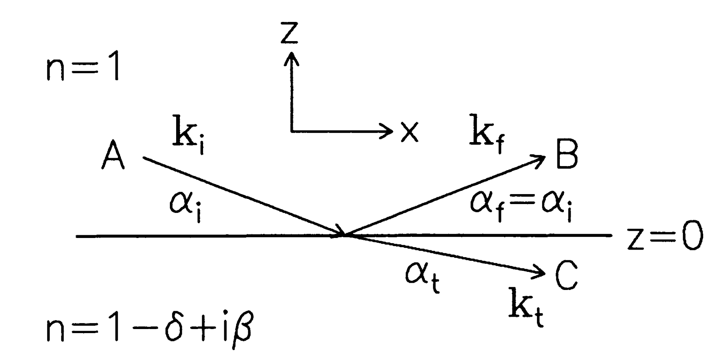
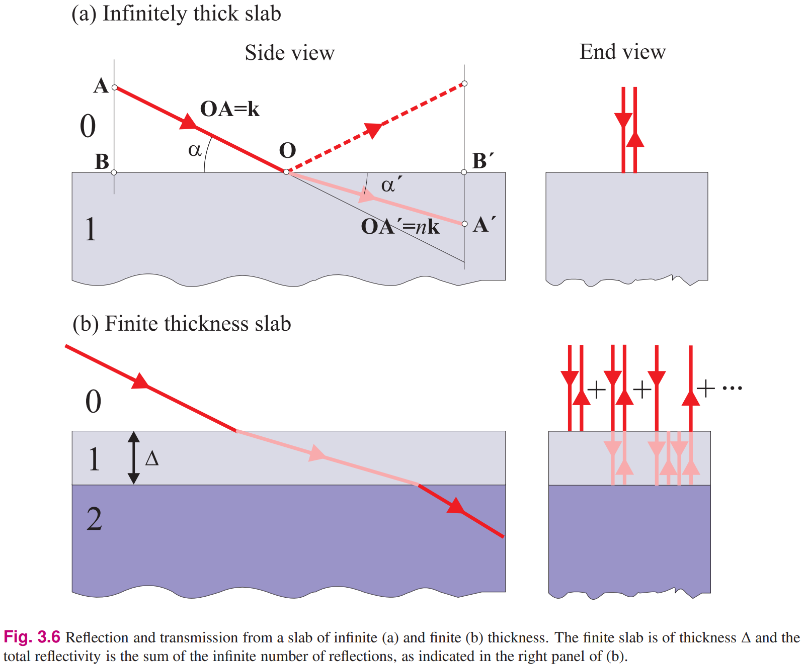
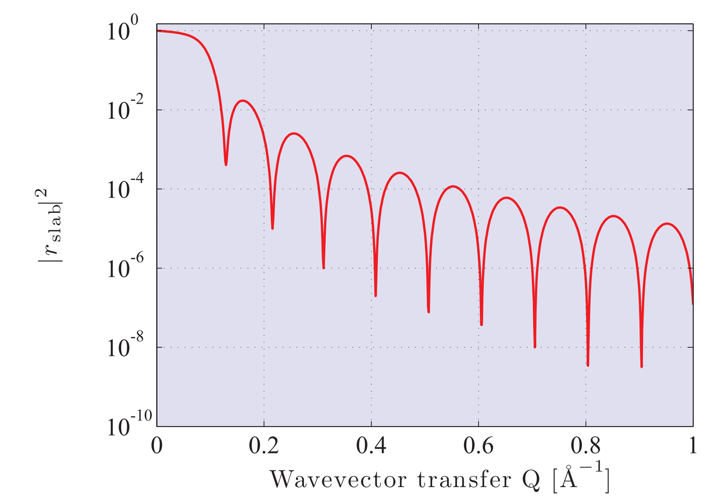
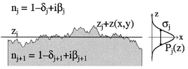

# V44 Röntgenreflektometrie

## How is X-ray radiation produced in an X-ray tube?
An einer Kathode wird eine Spannung angelegt.
Daraufhin treten aus dieser Kathode Elektronen aus.
Die Elektronen werden durch eine Hochspannung (kV) auf eine Anode beschleunigt.
Bei der Interaktion mit der Anode werden Bremsstrahlung (kontinuierlich) und Röntgenstrahlung (charakteristisch) freigesetzt.
Mithilfe eines Kristalls kann durch Bragg-Reflexion die gewünschte Wellenlänge gefiltert werden.

## What is a Göbel mirror and how does ist work?
Klassische optische Elemente können für Röntgenstrahlung nicht verwendet werden.
Um die Richtung von Röntgenstrahlung zu ändern können Kristalle verwendet werden, allerdings unterliegt diese Strahlung dann den Bragg-Winkeln, sodass eine bestimmte Wellenlänge auf einen bestimmten Ort geworfen wird.
Einen Ausweg bilden Göbelspiegel:
Ein Göbelspiegel ist ein Spiegel der dazu genutzt werden kann die Röntgenstrahlung einer Quelle auf ein Target zu lenken.
Um dies zu erreichen, wird ein Göbelspiegel als vielschichtiger Kristall mit variierendem Gitterabstand $d$ gefertigt.
Daher hängt die Konstruktion des Spiegels immer von den gegebenheiten des Experiments ab.
Ein Göbelspiegel ist parabolisch gebogen, damit der Strahl "parallelisiert" wird.

## How is the wave vector transfer defined in an X-ray reflectometry experiment?

Allgemein ist der Wellenvektortransfer definiert als:
$$\vec{q}=\vec{k}_a-\vec{k}_e$$
mit den Wellenvektoren $\vec{k}_e$ und $\vec{k}_a$ der einfallenden und auslaufenden ebenen Welle.
Bei der XRR wird der Wellenvektortransfer auf 2d reduziert wie im Tolan auf Seite 7 dargestellt:

Daraus folgen demnach die Formeln
$$k_e=k\begin{pmatrix}
   cos(\alpha_e) \\
   0\\
   -sin(\alpha_e)\\
\end{pmatrix}~~~k_a=k\begin{pmatrix}
    cos(\alpha_e) \\
    0\\
    sin(\alpha_e)\\
\end{pmatrix}$$
für den einfallenden Strahl und den auslaufenden Strahl.
Der Wellenvektortransfer in der XRR ist folglich definiert als
$$q=2k\begin{pmatrix}
    0\\
    0\\
    \sin{\alpha_e}
\end{pmatrix}$$

## What are Fresnel's formulae and what do they describe? What is the special feature of Fresnel's formulae in case of X-rays?
s-Polarisation:
$$r = \frac{n_1\cos(\alpha_1)-n_2\cos(\alpha_2)}{n_1\cos(\alpha_1)+n_2\cos(\alpha_2)}$$
$$t = \frac{2n_1}{n_1\cos(\alpha_1)+n_2\cos(\alpha_2)}$$
Für $\alpha_i>3a_c$:
$$R_f = \frac{\alpha_C}{2\alpha_i}$$
mit, $r_e$ klassischer Elektronenradius und $\rho$ Elektronendichte:
$$\alpha_c\approx\sqrt{2\delta}=\lambda\sqrt{\frac{r_e\rho}{\pi}}$$

## What are Kiessig oscillations and how do they occure?
<!-- Kiessig Oszillationen sind sprunghafte Änderungen der reflektierten Strahlung. -->
Kiessig Oszillationen sind Oszillationen der reflektierten Intensität abhängig von dem Einfallswinkel. Sie treten auf, wenn die Probe aus mehreren Schichten besteht, die sich in der Dichte unterscheiden. Der einfachste Fall beinhaltet eine einzelne Schicht. 

Formal werden diese Oszillationen durch die Formel
$$ r_\text{dünne Schicht}\approx-i\frac{4\pi\rho r_0\Delta}{Q}=-i\frac{\lambda\rho r_0\Delta}{\sin \alpha}$$
genähert.
- $\rho$ ist die Elektronendichte
- $\Delta$ ist die Dicke der Schicht
- $r_0$ Streulänge

Genaueres dazu kann in "Elements of Modern X-ray Physics" ab S. 81 nachgelesen werden.

## How does the Parratt algorithm work (qualitativly)?
"Elements of Modern X-ray Physics" ab S. 87

Zuvor wurde die Reflektivität einer einzelnen sehr dünnen Schicht berechnet. Neben der schon gegebenen Näherung für die Reflektivität gibt es auch eine exakte Formel
$$r_\text{Schicht}=\frac{r_{01}+r_{12}p^2}{1+r_{01}r_{12}p^2}$$
- $r_{01}$ ist die Reflektivität der ersten Grenzfläche
- $r_{12}$ ist die Reflektivität der zweiten Grenzfläche
- $p$ mit $p^2=\mathrm{e}^{iQ\Delta}$ ist ein Phasenfaktor zwischen den Grenzflächen

Diese Formel war dort noch nicht von großem nutzen. Mit ihrer Hilfe lässt sich allerdings die Reflektivität mehrerer Schichten berechnen. Genau dies ist die Aufgabe dees Parratt Algorithmus.
Im Parrat Algorithmus wird von der untersten Schicht als der N-ten Schicht ausgegangen und die Reflektivität berechnet 
$$r_{N-1,N}=\frac{r^{\prime}_{N-1,N}+r^{\prime}_{N,\infty}p_N^2}{1+r^{\prime}_{N-1,N}r^{\prime}_{N,\infty}p_N^2}$$ 
$^{\prime}$ gibt an, dass diese Reflektivitäten noch keine mehrfachen Reflexionen berücksichtigen. Das Ergebnis kann nun genutzt werden um die Reflektivität der darüber liegenden Schicht zu berechnen
$$r_{N-2,N-1}=\frac{r^{\prime}_{N-2,N-1}+r_{N-1,N}p_{N-1}^2}{1+r^{\prime}_{N-2,N-1}r_{N-1,N}p_{N-1}^2}$$
Dieses Verfahren kann rekursiv fortgesetzt werden bis die Reflektivität der obersten Schicht berechnet wurde. Die Reflektivität der obersten Schicht ist dann die Reflektivität des gesamten Systems. 

## How must the Parratt algorithm be modified to apply to rough surfaces? (Hier gerne noch ergänzen)
Im Tolan ab S. 14

Der Grundgedanke ist die Rauheit der Oberfläche durch eine Wahrscheinlichkeitsverteilung zu beschreiben.
Dazu wird sie als Enseble glatter Oberflächen angenähert.
Durch diese Verteilung soll beschrieben werden, wie häufig eine bestimmte z-Koordinate für die Grenzschicht auftaucht.
Es wird dann für verschiedene z-Koordinaten wieder die Reflektivität einer glatten Oberfläche berechnet und dann über die verschiedenen z-Koordinaten mit der Verteilung gemittelt. 

